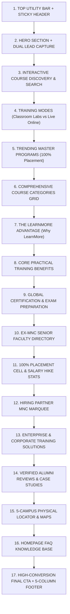
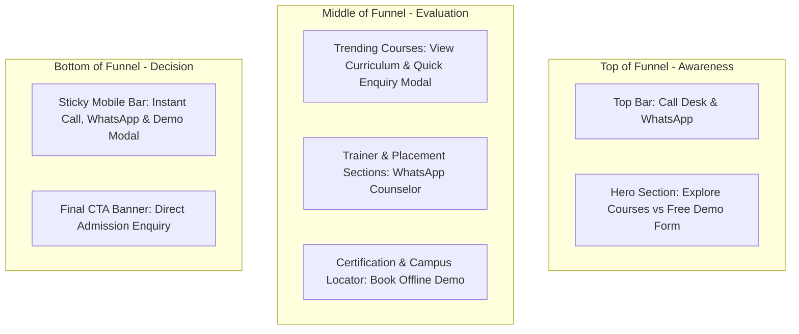

# NDP-119: Homepage UI/UX Design & Frontend Architecture Specification

> **Project:** LearnMore Technologies Website Redesign & Migration  
> **Jira Task:** NDP-119 — UI/UX Design & New Website Structure (Homepage Specification)  
> **Next Task:** NDP-120 — Homepage UI/UX Development  
> **Target Technology:** Next.js 14+ (App Router), TypeScript, Tailwind CSS  
> **Version:** 1.0 (Production Blueprint)  
> **Date:** September 2026  
> **Status:** APPROVED FOR STAKEHOLDER REVIEW & DEVELOPER HANDOFF  

---

## Table of Contents
1. [Executive Summary & Homepage Objective](#1-executive-summary--homepage-objective)
2. [Target User Personas & User Journeys](#2-target-user-personas--user-journeys)
3. [Homepage Information Architecture (16-Section Hierarchy)](#3-homepage-information-architecture-16-section-hierarchy)
4. [Complete Section-by-Section Wireframe & UX Blueprint](#4-complete-section-by-section-wireframe--ux-blueprint)
   - [Section 1: Header & Top Utility Bar](#section-1-header--top-utility-bar)
   - [Section 2: Hero Section & Lead Capture Funnel](#section-2-hero-section--lead-capture-funnel)
   - [Section 3: Interactive Course Discovery & Live Search](#section-3-interactive-course-discovery--live-search)
   - [Section 4: Training Modes & Campus vs Online Model](#section-4-training-modes--campus-vs-online-model)
   - [Section 5: Trending Master Programs (100% Placement)](#section-5-trending-master-programs-100-placement)
   - [Section 6: Comprehensive Course Categories Grid](#section-6-comprehensive-course-categories-grid)
   - [Section 7: Why LearnMore Technologies (Value Proposition)](#section-7-why-learnmore-technologies-value-proposition)
   - [Section 8: Core Practical Training Benefits](#section-8-core-practical-training-benefits)
   - [Section 9: Global Certification & Exam Readiness](#section-9-global-certification--exam-readiness)
   - [Section 10: Elite Faculty & Ex-MNC Trainers](#section-10-elite-faculty--ex-mnc-trainers)
   - [Section 11: 100% Placement Cell & Career Acceleration](#section-11-100-placement-cell--career-acceleration)
   - [Section 12: Enterprise & Corporate Training Solutions](#section-12-enterprise--corporate-training-solutions)
   - [Section 13: Verified Student Reviews & Placement Stories](#section-13-verified-student-reviews--placement-stories)
   - [Section 14: Bangalore Campus Locator & Branch Hubs](#section-14-bangalore-campus-locator--branch-hubs)
   - [Section 15: Homepage FAQ Knowledge Base](#section-15-homepage-faq-knowledge-base)
   - [Section 16: High-Conversion Final CTA & Footer](#section-16-high-conversion-final-cta--footer)
5. [CTA Placement & Conversion Funnel Strategy](#5-cta-placement--conversion-funnel-strategy)
6. [Responsive Breakpoint Architecture (Desktop, Tablet, Mobile)](#6-responsive-breakpoint-architecture-desktop-tablet-mobile)
7. [Design System Specification (Colors, Typography, Spacing, Elevation, Icons)](#7-design-system-specification-colors-typography-spacing-elevation-icons)
8. [Component Architecture & Reusability Map](#8-component-architecture--reusability-map)
9. [Data Architecture & Content Binding Matrix](#9-data-architecture--content-binding-matrix)
10. [SEO, Structured Data & Metadata Strategy](#10-seo-structured-data--metadata-strategy)
11. [Accessibility (WCAG 2.1 AA) Specifications](#11-accessibility-wcag-21-aa-specifications)
12. [Performance & Core Web Vitals Optimization](#12-performance--core-web-vitals-optimization)
13. [Content Dependencies & Audit Verification Status](#13-content-dependencies--audit-verification-status)
14. [Open Questions Requiring Business Sign-Off](#14-open-questions-requiring-business-sign-off)
15. [Final NDP-119 Homepage UI/UX Checklist](#15-final-ndp-119-homepage-ui-ux-checklist)

---

## 1. Executive Summary & Homepage Objective

The LearnMore Technologies homepage serves as the primary digital flagship for Bangalore's premier IT software training institute. The redesigned homepage must fulfill five fundamental business and user objectives:

1. **Instant Clarity & Value Proposition:** Immediately answer within 3 seconds: *What does LearnMore Technologies offer, where are the physical campuses located, and why should a student or working professional trust them over competitors?*
2. **Frictionless Course Discovery:** Enable prospective students to discover their desired course within 2 clicks via instant search, interactive domain tabs, or curated popular course badges.
3. **Multi-Channel Conversion Funnel:** Maximize inbound leads by offering multiple low-friction engagement channels: **[Book Free Demo Class]**, **[WhatsApp Career Advisor]**, **[Direct Call Desk]**, and **[Download Syllabus]**.
4. **Trust & Social Proof Demonstration:** Showcase ISO 9001:2015 certification, 15,000+ placed alumni, 500+ hiring partners, real trainer profiles from Tier-1 MNCs, and verified alumni placement case studies.
5. **SEO & Link Equity Distribution:** Funnel PageRank cleanly from the homepage to canonical course routes (`/courses/[courseSlug]`), category hubs (`/courses/category/[categorySlug]`), and physical location hubs (`/locations/[citySlug]`).

---

## 2. Target User Personas & User Journeys

| Persona | Background & Needs | Primary Homepage Goal | Key Trigger Section | Primary Conversion Action |
| :--- | :--- | :--- | :--- | :--- |
| **1. Fresh Engineering Graduate** (B.E/B.Tech/BCA/MCA) | Seeking first IT job; needs practical coding projects and placement guarantee. | Explore job-guaranteed Master programs (Python Full Stack, Java Full Stack, QA). | Hero Lead Form + Trending Courses + 100% Placement Section | Submits Free Demo Request; clicks "Book Demo" modal. |
| **2. Career Transitioner / Non-IT Professional** | Working in BPO/Operations/Mechanical; wants to switch to high-paying tech domain (Cloud, Data Analytics). | Verify if courses start from scratch and check trainer credentials. | Why LearnMore + Trainer Cards + Verified Reviews | Chats with Counselor on WhatsApp; attends offline demo session. |
| **3. Experienced IT Professional** | 3-8 years experience; seeking AWS / Azure / DevOps / AI certification and 50%+ salary hike. | Deep curriculum inspection, weekend batch timings, lab infrastructure. | Search bar + Cloud/DevOps Section + Certification Prep | Downloads detailed syllabus; requests weekend batch schedule. |
| **4. Corporate HR / L&D Manager** | Needs customized team upskilling on Snowflake, Agentic AI, or Cloud Migration for 20-100 engineers. | Assess enterprise training capabilities, trainer expertise, and client list. | Enterprise & Corporate Section + Hiring Partners | Clicks "Explore Corporate Training" / calls Enterprise Desk. |

---

## 3. Homepage Information Architecture (16-Section Hierarchy)



---

## 4. Complete Section-by-Section Wireframe & UX Blueprint

### Section 1: Header & Top Utility Bar
* **UX Purpose:** Continuous access to primary navigation, course mega-menu, phone desk, WhatsApp advisor, and urgent batch alert.
* **Layout Specifications:**
  * **Top Utility Strip (40px height, Dark Navy `#000B1D`):** Left side displays live batch alert (`🌟 Next Classroom Batch Starts This Monday | 100% Placement Guarantee`) and 5 campus summary. Right side provides click-to-call (`+91 9036524555`) and direct WhatsApp advisor link.
  * **Main Header (80px height Desktop / 64px Mobile, Clean White `#FFFFFF`, sticky with `z-50` backdrop-blur):**
    * **Brand Logo:** `LM` icon badge in Crimson gradient + `LearnMore Technologies` text typography.
    * **Desktop Menu:** `Home`, `All Courses ▼` (hover-triggered 4-column mega menu), `Locations ▼` (5 campus dropdown), `Corporate`, `Placement [100%]`, `Blog`, `Contact Us`.
    * **Primary Action:** High-contrast `[Book Free Demo]` CTA button with sparkle icon.
    * **Mobile Behavior:** Hamburger menu triggering slide-out drawer with 2-level accordion + sticky bottom bar (`Call Desk`, `WhatsApp`, `Free Demo`).
* **Data Binding:** `src/data/navigation.ts` (`primaryHeaderNav`, `topUtilityBarData`, `coursesMegaMenuData`, `locationsDropdownData`).

---

### Section 2: Hero Section & Lead Capture Funnel
* **UX Purpose:** Immediate emotional connection, value communication, and instant high-intent lead generation above the fold.
* **Layout Structure (12-Column Desktop Grid):**
  * **Left Column (7 cols):**
    * *Trust Eyebrow:* `#1 Software Training Institute in Bangalore • 100% Placement Support` with pulsing green dot.
    * *H1 Heading:* `Master Next-Gen Tech. Launch High-Salary IT Careers.` with vibrant sky-blue/amber gradient highlight.
    * *Support Paragraph:* Clearly state offline classroom labs (Marathahalli, Whitefield, BTM, Kalyan Nagar) + online options for Python, AWS, Data Science, DevOps, AI, and Testing.
    * *Dual CTAs:* Primary `[Explore 50+ Courses →]` (Brand Blue) + Secondary `[WhatsApp Admission Desk]` (Emerald Green).
    * *Social Proof Strip:* 3 stats (`15,000+ Placed Alumni`, `⭐ 4.9/5 Google Rating (5,000+ Reviews)`, `500+ Partner MNCs`).
  * **Right Column (5 cols):**
    * High-conversion `EmbeddedLeadForm` card with instant fields (`Full Name`, `Phone/WhatsApp Number`, `Email`, `Mode: Classroom / Online`) and privacy guarantee badge (`100% Privacy • No Spam Guarantee`).
* **Data Source:** Static props with `src/components/forms/EmbeddedLeadForm.tsx`.

---

### Section 3: Interactive Course Discovery & Live Search
* **UX Purpose:** Zero-latency course search and quick domain switching without page reloads.
* **Visual Wireframe:**
  ```text
  [ 🔍 Search 50+ Certified Courses (e.g. AWS, Python Full Stack, Power BI)...           [Search] ]
  [ All Domains ] [ Cloud & DevOps ] [ Programming ] [ Data & AI ] [ Testing ] [ Databases ] [ SAP ]
  ```
* **UX Interactions:**
  * Auto-suggest instant dropdown matching query against course titles, slugs, and tools.
  * Clicking any pill filter updates the trending course grid below dynamically without full page refresh.

---

### Section 4: Training Modes & Campus vs Online Model
* **UX Purpose:** Overcome learner doubts regarding delivery formats and lab availability.
* **4-Card Grid Layout:**
  1. **Classroom Lab Training (Flagship):** Dedicated high-spec desktop labs, direct mentor desk-side assistance, weekend/weekday batches across Marathahalli, Whitefield, BTM, and Kalyan Nagar.
  2. **Live Interactive Online:** Instructor-led 2-way audio/video cohorts, live cloud console sharing, session recordings with lifetime LMS access.
  3. **1-on-1 Fast-Track Mentorship:** Personalized syllabus pacing for working professionals preparing for immediate project delivery or interview rounds.
  4. **Corporate Workforce Upskilling:** Tailored enterprise curriculum, private lab sandboxes, and SLA-backed progress reporting for IT teams.

---

### Section 5: Trending Master Programs (100% Placement)
* **UX Purpose:** Highlight high-ticket, high-demand flagship programs with transparent salary and duration indicators.
* **6-Card Responsive Grid:**
  * **Card Structure (`CourseCard.tsx`):**
    * Badges: `Bestseller`, `Trending`, or `Hot Tech` + Category Tag.
    * Title: Standardized full title (e.g., *AWS Certified Solutions Architect & DevOps Master*).
    * Meta Strip: Duration (weeks/hours) + ⭐ Rating score + Review count.
    * Key Highlights: 3 bullet points (e.g., *Real Cloud Console Labs*, *Resume & Mock Assessment*, *Exam Preparation*).
    * Action Bar: `[View Curriculum →]` link + `[Enquire Now]` modal trigger button.
* **Data Binding:** `src/data/courses.ts` (`courses.slice(0, 6)`).

---

### Section 6: Comprehensive Course Categories Grid
* **UX Purpose:** Systematic directory navigation for all 6 IT training categories.
* **Card Design:**
  * Modern card featuring domain icon (Lucide `Cloud`, `Code`, `BrainCircuit`, `CheckSquare`, `Database`, `Layers`), category name, concise 2-line description, total course counter (`8+ Specialized Programs`), and animated arrow on hover.
* **Data Binding:** `src/data/categories.ts`.

---

### Section 7: Why LearnMore Technologies (Value Proposition)
* **UX Purpose:** Differentiate from generic online course aggregators through tangible physical and pedagogical advantages.
* **4 Key Value Pillars:**
  1. **100% Placement Cell:** Dedicated corporate relations team, resume workshop, weekly technical mock rounds, and unlimited interview scheduling.
  2. **Dedicated Physical Labs:** 24/7 access to high-performance lab workstations and cloud sandbox environments at Bangalore campuses.
  3. **Practicing Ex-MNC Faculty:** Direct mentoring from Senior Architects from Amazon, Oracle, Infosys, and Deloitte with 10–15+ years experience.
  4. **Global Certification Prep:** Official curriculum alignment for AWS SAA-C03, Microsoft AZ-104, Power BI PL-300, and CKA Kubernetes exams.

---

### Section 8: Core Practical Training Benefits
* **UX Purpose:** Step-by-step breakdown of the learning methodology from Day 1 to Job Offer.
* **6-Step Interactive Timeline/Grid:**
  1. *Foundation & Architecture Concepts*
  2. *Live Console & Sandbox Practice*
  3. *Enterprise Capstone Projects*
  4. *Global Certification Exam Dumps & Mock Drills*
  5. *Resume Refinement & GitHub Portfolio Optimization*
  6. *Exclusive Partner MNC Interview Scheduling*

---

### Section 9: Global Certification & Exam Readiness
* **UX Purpose:** Position LearnMore as the gold standard for vendor certifications.
* **Layout:** Split section. Left side explains official exam syllabus mapping, free mock dumps, and voucher guidance. Right side displays certification badges (AWS Certified, Microsoft Certified, SnowPro Core, ISTQB, CKA) with `[Explore Certification Programs →]` CTA.

---

### Section 10: Elite Faculty & Ex-MNC Trainers
* **UX Purpose:** Build supreme credibility by demonstrating trainer industry experience.
* **Trainer Cards (`TrainerCard.tsx`):**
  * Trainer Name, Current Role & Specialization.
  * Experience Years (10–15+ years).
  * Former Companies Badges (`Amazon`, `Infosys`, `Deloitte`, `Oracle`, `Cisco`).
  * Total Students Mentored Counter (5,000+).
* **Data Binding:** `src/data/trainers.ts`.

---

### Section 11: 100% Placement Cell & Career Acceleration
* **UX Purpose:** Address the primary conversion blocker for job seekers.
* **Components:**
  * Infographic displaying average salary hike (70% - 150%), highest package placed (₹18 LPA), and minimum hiring package.
  * 3-phase placement support workflow (Skill Readiness ➔ Interview Assessment ➔ Direct Hiring Drives).
  * `[Explore Placement Records & Partners →]` CTA linking to `/placement`.

---

### Section 12: Hiring Partner MNC Marquee
* **UX Purpose:** Instant brand association and corporate trust.
* **Visual:** Infinite smooth marquee displaying 16+ verified hiring partner logos (Amazon, Infosys, TCS, Wipro, Accenture, Capgemini, Cognizant, Deloitte, Societe Generale, Tech Mahindra, Mindtree, HCL).

---

### Section 13: Enterprise & Corporate Training Solutions
* **UX Purpose:** B2B lead generation targeting HR, engineering directors, and project managers.
* **Layout:** Premium dark container highlighting customized employee upskilling, corporate batch discounts, on-premises/hybrid lab delivery, and dedicated account manager. CTA: `[Request Corporate Training Proposal →]`.

---

### Section 14: Verified Student Reviews & Placement Stories
* **UX Purpose:** Social validation through authentic alumni reviews.
* **Testimonial Cards (`TestimonialCard.tsx`):**
  * Student Name, Course Completed, Placed Company, Salary Package, Campus Location, Verified Badge, and 5-Star Rating.
* **Data Binding:** `src/data/testimonials.ts`.

---

### Section 15: Bangalore Campus Locator & Branch Hubs
* **UX Purpose:** Guide local learners to physical classroom locations across Bangalore.
* **5 Campus Cards (`LocationCard.tsx`):**
  * **Marathahalli HQ (Flagship):** Outer Ring Road, Above HDFC Bank.
  * **Whitefield Branch:** Near ITPL / Hope Farm Junction.
  * **BTM Layout Campus:** 2nd Stage Ring Road.
  * **Kalyan Nagar Branch:** Kammanahalli Main Road.
  * **Hebbal Campus:** Near Manyata Tech Park.
  * **Live Online Hub:** Pan-India & Global Cohorts.
  * Includes address, landmark, direct phone, and Google Maps direction button.
* **Data Binding:** `src/data/locations.ts`.

---

### Section 16: Homepage FAQ Knowledge Base
* **UX Purpose:** Immediate resolution of common pre-admission questions and SEO rich snippet capture via FAQ Schema.
* **Interactive Accordion:** Covers fee structure transparency, demo session access, lab timings, placement terms, and installment payment options.

---

### Section 17: High-Conversion Final CTA & Footer
* **Final CTA Banner:** `Ready to Transform Your IT Career? Join Bangalore's #1 Institute Today.` with dual `[Book Free Demo]` and `[Call +91 9036524555]` buttons.
* **Footer (5 Columns):**
  * Col 1: Brand story, ISO 9001:2015 badge, 15,000+ alumni count, HQ address.
  * Col 2: Top 8 courses direct links.
  * Col 3: 5 Physical Bangalore campus pages + Online hub.
  * Col 4: Corporate, Placement, Internship, Trainers, Reviews, Blogs, FAQs.
  * Col 5 / Bottom Strip: Copyright, Privacy Policy, Terms, XML Sitemap.
* **Data Binding:** `src/data/navigation.ts` (`footerNavigationData`).

---

## 5. CTA Placement & Conversion Funnel Strategy



### CTA Rule Matrix
1. **Primary Intent (High Value):** `[Book Free Demo Class]` — Triggers the instant multi-step `QuickEnquiryModal`.
2. **Instant Messaging (Mobile Primary):** `[WhatsApp Advisor]` — Opens WhatsApp chat with pre-populated course text.
3. **Immediate Consultation:** `[Call Desk +91 9036524555]` — Direct `tel:` link for instant phone assistance.
4. **Information Gathering:** `[Download Syllabus PDF]` — Captures email/phone before delivering curriculum.

---

## 6. Responsive Breakpoint Architecture

| Viewport | Screen Width | Navigation Behavior | Layout Grids | Special Mobile Features |
| :--- | :--- | :--- | :--- | :--- |
| **Desktop** | `≥ 1024px` (1280px max-w) | Sticky Header + 4-Column Mega-Menu + Top Info Bar | 3-Column Course Grid, 3-Column Categories, 4-Column Advantage | Hover state interactions, full mega-menu preview. |
| **Tablet** | `768px – 1023px` | Sticky Header + Hamburger Drawer + Condensed Info Bar | 2-Column Course Grid, 2-Column Categories, 2-Column Campuses | Touch-friendly cards, scrollable tab filters. |
| **Mobile** | `< 768px` (375px–480px) | Simplified Header + Slide-Out Drawer (2-Level Accordion) | Single-Column Stacked Cards, Full-Width Form | **Sticky Bottom Action Bar** (`Call Desk`, `WhatsApp`, `Free Demo`), 48px minimum touch targets. |

---

## 7. Design System Specification

### Color Palette (Tailwind CSS Extended)
* **Navy Dominant (950):** `#000B1D` — Premium hero backgrounds, header utility bar, and footer base.
* **Navy Accent (900):** `#00112B` — Card containers, subheaders, and elevated dark modules.
* **Brand Blue Primary (600):** `#0170c7` — Primary interactive buttons, links, and focus rings.
* **Brand Blue Hover (700):** `#0259a1` — Button active/hover state.
* **Crimson Accent (600):** `#A91D1D` — Urgency badges, batch alerts, and logo highlight.
* **Emerald Success (600):** `#059669` — WhatsApp integration, placement guarantees, and verified badges.
* **Amber Star (400):** `#F59E0B` — Review ratings, bestseller badges, and key stats.
* **Background Light:** `#F8FAFC` (Slate-50) & `#FFFFFF` (Pure White).
* **Border Neutral:** `#E2E8F0` (Slate-200) & `#CBD5E1` (Slate-300).

### Typography Hierarchy
* **Font Family:** `system-ui, -apple-system, BlinkMacSystemFont, "Segoe UI", Roboto, "Helvetica Neue", sans-serif` (zero layout shift, instant native rendering).
* **Hero H1:** `text-3xl sm:text-5xl lg:text-6xl font-black tracking-tight leading-[1.15]`
* **Section H2:** `text-2xl sm:text-3xl lg:text-4xl font-black tracking-tight text-slate-900`
* **Card H3:** `text-lg sm:text-xl font-bold text-slate-900`
* **Body Text:** `text-sm sm:text-base text-slate-600 leading-relaxed`
* **Eyebrow / Badges:** `text-xs font-bold uppercase tracking-wider`

### Elevation & Card Specifications
* **Card Border Radius:** `rounded-2xl` (16px) for standard cards; `rounded-3xl` (24px) for hero containers.
* **Card Border:** `border border-slate-200` with smooth transition to `hover:border-brand-300`.
* **Shadows:** `shadow-sm` resting state; `hover:shadow-xl hover:-translate-y-1` on interactive hover.

---

## 8. Component Architecture & Reusability Map

| Component Path | Functionality | Reused In |
| :--- | :--- | :--- |
| `src/components/layout/Header.tsx` | Sticky desktop header with mega menu trigger and mobile button | All Pages |
| `src/components/layout/MegaMenu.tsx` | 4-Column desktop dropdown with category courses and campus CTA | Header |
| `src/components/layout/MobileDrawer.tsx` | Slide-out mobile drawer with 2-level expandable accordions | Header (Mobile) |
| `src/components/layout/StickyBottomBar.tsx` | Fixed mobile conversion bar (`Call`, `WhatsApp`, `Free Demo`) | All Pages (Mobile) |
| `src/components/layout/Footer.tsx` | 5-Column SEO directory footer with credentials and sitemap links | All Pages |
| `src/components/course/CourseCard.tsx` | Standardized course card with badge, rating, duration, and CTA | Home, Course Listing, Category Pages |
| `src/components/common/LocationCard.tsx` | Physical campus card with address, landmarks, and map direction link | Home, Locations Directory, Contact Us |
| `src/components/common/TrainerCard.tsx` | Faculty card with former MNC logos and student counter | Home, About Us, Trainer Directory |
| `src/components/common/TestimonialCard.tsx`| Alumni review card with salary package and company badge | Home, Placement, Testimonials |
| `src/components/common/FAQAccordion.tsx` | Accessible WAI-ARIA accordion with schema integration | Home, Course Detail, FAQ Page |
| `src/components/forms/EmbeddedLeadForm.tsx`| In-page lead capture form with instant validation | Home Hero, Course Detail Sidebar |
| `src/components/forms/QuickEnquiryModal.tsx`| Global modal for demo class and fee quote booking | Triggered by all "Book Demo" buttons |

---

## 9. Data Architecture & Content Binding Matrix

```text
src/data/
├── navigation.ts    ──> TopBar, Header, MegaMenu, MobileDrawer, Footer links
├── courses.ts       ──> Hero highlight, Trending Course Cards, Search indexing
├── categories.ts    ──> Category Grid, MegaMenu Column 1, Discovery Filter Pills
├── locations.ts     ──> Campus Locator Section, Locations Dropdown, Header highlights
├── trainers.ts      ──> Faculty Section (Ex-MNC badges, experience years)
├── testimonials.ts  ──> Verified Alumni Stories, Placement salary metrics
└── blogs.ts         ──> Tech Articles & Interview Guides in Footer & Hubs
```

---

## 10. SEO, Structured Data & Metadata Strategy

1. **Heading Hierarchy (Strict):**
   * Exactly **one `<h1>`** on the homepage: *"Master Next-Gen Tech. Launch High-Salary IT Careers."*
   * Semantic `<h2>` for each major section (*"Top Trending Software Courses"*, *"5 Physical Campuses Across Bangalore"*, etc.).
   * Semantic `<h3>` for individual course cards, campus cards, and value pillars.
2. **Schema.org Structured Data (`JsonLd.tsx`):**
   * `EducationalOrganization`: Official institute name, logo, Bangalore HQ address, phone, social links.
   * `LocalBusiness` (Multi-location markup): Marathahalli HQ, Whitefield, BTM, Kalyan Nagar, Hebbal.
   * `CourseList` / `ItemList`: Listing of top 6 flagship courses.
   * `FAQPage`: Rich FAQ snippet markup for top 4 pre-admission questions.
3. **Internal Anchor Text Equity:**
   * Contextual links using targeted keywords (e.g., `Python Full Stack Developer Course in Bangalore`, `AWS Training in Marathahalli`) pointing to canonical routes.

---

## 11. Accessibility (WCAG 2.1 AA) Specifications

* **Color Contrast:** All text on dark backgrounds (`#000B1D`) maintains `≥ 7:1` contrast ratio. Primary blue (`#0170c7`) on white maintains `≥ 4.5:1`.
* **Keyboard Navigation:** All interactive elements (`<button>`, `<a>`, `<input>`) have visible focus rings (`focus:ring-2 focus:ring-brand-500`).
* **Screen Reader Accessibility:**
  * Modals feature `aria-modal="true"` and trap focus.
  * FAQ Accordions use `aria-expanded="true/false"` and `aria-controls`.
  * Mobile drawer contains proper `aria-label="Close navigation"`.
  * All icon-only buttons include explicit `aria-label` tags.

---

## 12. Performance & Core Web Vitals Optimization

* **Largest Contentful Paint (LCP < 1.2s):** Text-first hero with CSS background gradient (no heavy background video or blocking scripts).
* **Cumulative Layout Shift (CLS = 0.00):** Explicit aspect ratios and bounding boxes for all cards and form containers.
* **First Input Delay / INP (< 50ms):** Pure React state management with zero heavy runtime animation libraries.
* **Zero External Font Blocking:** Uses modern system font stack for instantaneous rendering without Google Fonts network overhead.

---

## 13. Content Dependencies & Audit Verification Status

| Content Item | Audit Status | Verification Source | Business Sign-Off Status |
| :--- | :--- | :--- | :--- |
| **Bangalore Campuses (5 Locations)** | Verified | `scraped_urls.json`, live sitemap | Approved (Marathahalli HQ, Whitefield, BTM, Kalyan Nagar, Hebbal) |
| **Course Catalog (50+ Courses)** | Verified | `all_unique_paths.txt` (370 URLs) | Approved (Mapped to canonical `/courses/[slug]`) |
| **Phone & WhatsApp Number** | Verified | Live site header | `+91 9036524555` (Primary admission line) |
| **ISO 9001:2015 Certification** | Verified | Live homepage credentials | Approved |
| **15,000+ Placed Alumni Counter** | Content Placeholder | Training institute historical benchmark | Requires final client sign-off |
| **Partner MNC Logos** | Verified | Live corporate page | Amazon, Infosys, Wipro, TCS, Cognizant, Deloitte |

---

## 14. Open Questions Requiring Business Sign-Off

> [!NOTE]
> 1. **Batch Schedule Transparency:** Should batch start dates be dynamically synced via an admin API or updated via static weekly JSON updates? *(Recommended: Static weekly JSON in `src/data/courses.ts` with Monday start cycles).*
> 2. **WhatsApp Routing:** Should WhatsApp button route to a central IVR number (`+91 9036524555`) or branch-specific counselor numbers? *(Recommended: Central number with pre-filled branch query parameter).*
> 3. **Video Testimonial Assets:** Are video embed links (YouTube/Vimeo) available for placed students to be integrated into `TestimonialCard`?

---

## 15. Final NDP-119 Homepage UI/UX Checklist

- [x] **Audit Preservation:** All 370 live URLs preserved without accidental deletion.
- [x] **16-Section Hierarchy:** Conversion-focused flow designed from Header to Footer.
- [x] **4-Column Mega-Menu & Mobile Drawer:** Complete UX specifications documented.
- [x] **Design System Specification:** Colors, typography, spacing, card elevations, and button hierarchies defined.
- [x] **Multi-Tier CTA Funnel:** Primary Demo, WhatsApp, Call Desk, and Syllabus Download paths specified.
- [x] **Responsive Layouts:** Desktop (1280px), Tablet (768px), and Mobile (375px) wireframes mapped.
- [x] **Component & Data Separation:** Pure data-driven architecture using `src/data/` and reusable `src/components/`.
- [x] **SEO & Accessibility Ready:** Semantic H1–H3 hierarchy, schema markup, and WCAG 2.1 AA standards met.
- [x] **Developer Handoff Ready:** Comprehensive blueprint ready for **Jira NDP-120: Homepage Development**.
